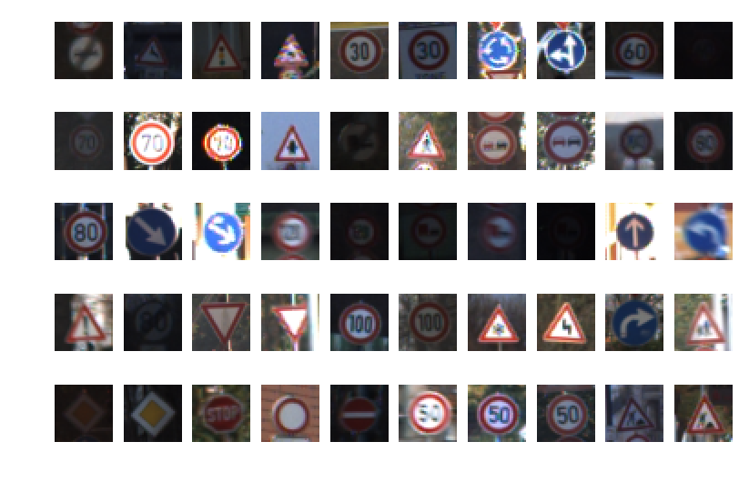
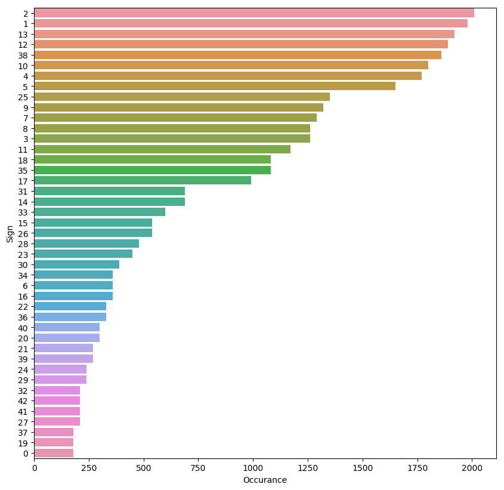
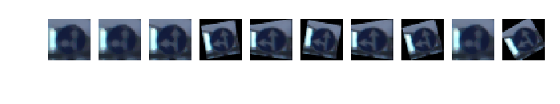
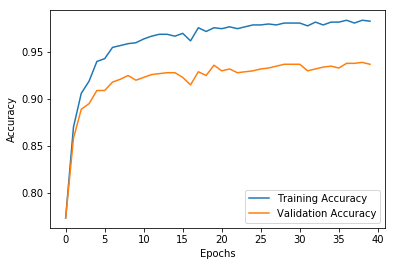
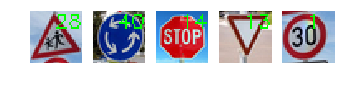
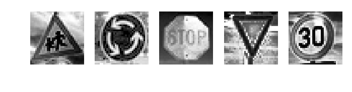
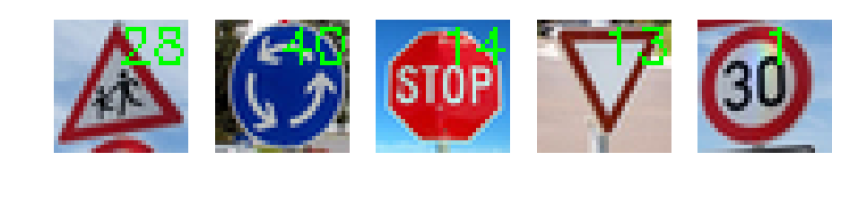
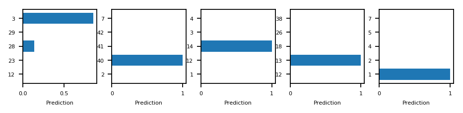

# Self-Driving Car Engineer Nanodegree

## Deep Learning Traffic Sign Classifier

## Step 1: Dataset Summary & Exploration

The pickled data is a dictionary with 4 key/value pairs:

- `'features'` is a 4D array containing raw pixel data of the traffic sign images, (num examples, width, height, channels).
- `'labels'` is a 1D array containing the label/class id of the traffic sign. The file `signnames.csv` contains id -> name mappings for each id.
- `'sizes'` is a list containing tuples, (width, height) representing the original width and height the image.
- `'coords'` is a list containing tuples, (x1, y1, x2, y2) representing coordinates of a bounding box around the sign in the image. **THESE COORDINATES ASSUME THE ORIGINAL IMAGE. THE PICKLED DATA CONTAINS RESIZED VERSIONS (32 by 32) OF THESE IMAGES**

    Number of training examples = 34799
    Number of testing examples = 4410
    Number of validation examples = 12630
    Image data shape = (32, 32, 3)
    Number of classes = 43

There are around 34000 images in our training data that display 43 seperate classes of traffic signs. The input comes as a 32x32 image that contains RGB channels.

We will train the model to learn from the training set, we use the validation set to see the effect on a bigger scale when changing the hyperparameters and will ultimatly measure the models performance against the 4410 examples of the test set.

A minimum of 0.93 validation accuracy will be required for the project.

### Include an exploratory visualization of the dataset

First thing that can be seen in the data is that its ordered. To display a variaty of example pictures, I will slice the training data roughly with the average count each image should be included.  

The road signs have some interesting properties, which might be interesting for processing later:

Shapes:
- mostly round shapes (75%)
- triangular is 2nd highest but features up and down (eg. Traffic Light or Yield)
- rectangle occurs once (Priority Road)
- hexagon occurs once (Stop)

Colors:
- most dominatant colors are clearly red, blue and white
- blue signs always feature one or more white arrows, which determine its class (also red signs dont feature white arrows since their background is white), therefore the blue channel does not hold much information
- red signs come in multiple shapes, but the most similar signs are round with the information of the sign in the middle (eg Speed Limit, driving limitations or caution signals) 

General:
- some images are really bright, some are almost black. The images will have to be normalized to clearly identify the distinct parts of each class
- traffic sign and background are not clearly distinct, contrast needs to be normalized
- RGB channels should be disgarded in favor of R channel, since blue signs show distinct properties anyway and the only yellow sign has a unique shape. Red channel is clearly the best option, since the majority of observations display red color. 

Since we have 43 different classes, one thing that we have to consider when implementing a neural network is distribution bias. With the given distribution of pictures our model will favor higher occuring road signs when unsure what to pick. There is no ground truth here, but an equal occurance will to prevent our model from overfitting in a particular direction, wheras keeping the given distribution will favor more frequently occuring signs in real world. When checking the distributions of the images, we can clearly see that some images occur around 2000 times, whereas some class occurances are only around 200 images. 

----

## Step 2: Design and Test a Model Architecture

### Pre-process the Data Set

Since we learned earlier that the train data has a distribution bias, I tried two approaches to achieve a better validation accuracy. Regardless of the bias, we need to create more training data by augmenting the given data set. When thinking of how these images will be taken from a vehicle, the augmenting operations will be:
- blurring (to simulate a driving vehicle)
- perspective transform (either left or right to simulate the perspective of taking the picture)
- rotation (to improve stability of observations) 

The augmentations have some sort of randomizer in them, that determines the blur, the degree of rotation, and the warp to left or right. 

After a short demonstration of the data augmentations, I state how many pictures of each class should be used for training. 

The two approaches feature creating a dictionary for each label and storing the indexes of the corresponding image within the key. Then I can either create a target sample amount (option 1) or to keep the distribution state how many times each image should be randomly augmented (option 2). This should in general improve the models performance on accuracy by more generalized approach to classification. 

After evaluation I achieved better results with Option 1.

    129000 training samples

After creating augmented images of the originals, the input data is send through the preparation pipeline, consisting of:
- contrast equalization to improve performance on bright or shady pictures
- select only red channel
- scale the values from 0,255 between 0,1

The pipeline is then applied to train, validation and test data. 

### Model Architecture

The designed model is really similar to LeNet. It consists out of 3 Convolutional Layers and 4 flat Dense Layers. 

| Layer                                        | Shape    |
|----------------------------------------------|----------|
| Input Image                                  | 32x32x1  |
| Conv2d / ReLu / Dropout (0.95)              | 28x28x8  |
| Conv2d / ReLu / MaxPooling / Dropout (0.9) | 24x24x16 |
| Conv2d / ReLu / MaxPooling / Dropout (0.9) | 20x20x32 |
| Flatten / Dense / ReLu / Dropout (0.6)     | 512      |
| Dense / ReLu / Dropout (0.6)               | 256      |
| Dense / ReLu / Dropout (0.6)               | 128      |
| Dense                                      | 43       |

As for the hyperparameters, I choose 40 Epochs and a Batch Size of 256. 

With the later implemented decay (1e-5) of the learning rate (1e-3) I try to smooth the learning gradually over time to prevent the model from adapting to quickly deep in training process. I noticed that starting with a higher learning rate speeds up the earlier training quite a bit.

For monitoring the training training and validation accuracy will be stored and printed during the process.

    Training...
    
    EPOCH 1 ...
    Training Accuracy   = 0.773
    Validation Accuracy = 0.773
    
    EPOCH 2 ...
    Training Accuracy   = 0.870
    Validation Accuracy = 0.858
    
    EPOCH 3 ...
    Training Accuracy   = 0.906
    Validation Accuracy = 0.889
    
    EPOCH 4 ...
    Training Accuracy   = 0.919
    Validation Accuracy = 0.895
    
    EPOCH 5 ...
    Training Accuracy   = 0.940
    Validation Accuracy = 0.909
    
    EPOCH 6 ...
    Training Accuracy   = 0.943
    Validation Accuracy = 0.909
    
    EPOCH 7 ...
    Training Accuracy   = 0.955
    Validation Accuracy = 0.918
    
    EPOCH 8 ...
    Training Accuracy   = 0.957
    Validation Accuracy = 0.921
    
    EPOCH 9 ...
    Training Accuracy   = 0.959
    Validation Accuracy = 0.925
    
    EPOCH 10 ...
    Training Accuracy   = 0.960
    Validation Accuracy = 0.920
    
    EPOCH 11 ...
    Training Accuracy   = 0.964
    Validation Accuracy = 0.923
    
    EPOCH 12 ...
    Training Accuracy   = 0.967
    Validation Accuracy = 0.926
    
    EPOCH 13 ...
    Training Accuracy   = 0.969
    Validation Accuracy = 0.927
    
    EPOCH 14 ...
    Training Accuracy   = 0.969
    Validation Accuracy = 0.928
    
    EPOCH 15 ...
    Training Accuracy   = 0.967
    Validation Accuracy = 0.928
    
    EPOCH 16 ...
    Training Accuracy   = 0.970
    Validation Accuracy = 0.923
    
    EPOCH 17 ...
    Training Accuracy   = 0.962
    Validation Accuracy = 0.915
    
    EPOCH 18 ...
    Training Accuracy   = 0.976
    Validation Accuracy = 0.929
    
    EPOCH 19 ...
    Training Accuracy   = 0.972
    Validation Accuracy = 0.925
    
    EPOCH 20 ...
    Training Accuracy   = 0.976
    Validation Accuracy = 0.936
    
    EPOCH 21 ...
    Training Accuracy   = 0.975
    Validation Accuracy = 0.930
    
    EPOCH 22 ...
    Training Accuracy   = 0.977
    Validation Accuracy = 0.932
    
    EPOCH 23 ...
    Training Accuracy   = 0.975
    Validation Accuracy = 0.928
    
    EPOCH 24 ...
    Training Accuracy   = 0.977
    Validation Accuracy = 0.929
    
    EPOCH 25 ...
    Training Accuracy   = 0.979
    Validation Accuracy = 0.930
    
    EPOCH 26 ...
    Training Accuracy   = 0.979
    Validation Accuracy = 0.932
    
    EPOCH 27 ...
    Training Accuracy   = 0.980
    Validation Accuracy = 0.933
    
    EPOCH 28 ...
    Training Accuracy   = 0.979
    Validation Accuracy = 0.935
    
    EPOCH 29 ...
    Training Accuracy   = 0.981
    Validation Accuracy = 0.937
    
    EPOCH 30 ...
    Training Accuracy   = 0.981
    Validation Accuracy = 0.937
    
    EPOCH 31 ...
    Training Accuracy   = 0.981
    Validation Accuracy = 0.937
    
    EPOCH 32 ...
    Training Accuracy   = 0.978
    Validation Accuracy = 0.930
    
    EPOCH 33 ...
    Training Accuracy   = 0.982
    Validation Accuracy = 0.932
    
    EPOCH 34 ...
    Training Accuracy   = 0.979
    Validation Accuracy = 0.934
    
    EPOCH 35 ...
    Training Accuracy   = 0.982
    Validation Accuracy = 0.935
    
    EPOCH 36 ...
    Training Accuracy   = 0.982
    Validation Accuracy = 0.933
    
    EPOCH 37 ...
    Training Accuracy   = 0.984
    Validation Accuracy = 0.938
    
    EPOCH 38 ...
    Training Accuracy   = 0.981
    Validation Accuracy = 0.938
    
    EPOCH 39 ...
    Training Accuracy   = 0.984
    Validation Accuracy = 0.939
    
    EPOCH 40 ...
    Training Accuracy   = 0.983
    Validation Accuracy = 0.937
    
    Model saved

With training done, I can now plot the training and validation accuary over Epochs.

### Train, Validate and Test the Model

A final rundown on the model performance:

    INFO:tensorflow:Restoring parameters from ./cnn_model
    Train Accuracy = 0.983
    Valid Accuracy = 0.937
    Test Accuracy = 0.954

---

## Step 3: Test a Model on New Images

To highlight the performance of the model I searched for some traffic sign images and formated them according to the model input (32x32x3). The target class was then taken from the appending signnames list. 

<table border="1" class="dataframe">
  <thead>
    <tr style="text-align: right;">
      <th></th>
      <th>ClassId</th>
      <th>SignName</th>
    </tr>
  </thead>
  <tbody>
    <tr>
      <th>0</th>
      <td>0</td>
      <td>Speed limit (20km/h)</td>
    </tr>
    <tr>
      <th>1</th>
      <td>1</td>
      <td>Speed limit (30km/h)</td>
    </tr>
    <tr>
      <th>2</th>
      <td>2</td>
      <td>Speed limit (50km/h)</td>
    </tr>
    <tr>
      <th>3</th>
      <td>3</td>
      <td>Speed limit (60km/h)</td>
    </tr>
    <tr>
      <th>4</th>
      <td>4</td>
      <td>Speed limit (70km/h)</td>
    </tr>
    <tr>
      <th>5</th>
      <td>5</td>
      <td>Speed limit (80km/h)</td>
    </tr>
    <tr>
      <th>6</th>
      <td>6</td>
      <td>End of speed limit (80km/h)</td>
    </tr>
    <tr>
      <th>7</th>
      <td>7</td>
      <td>Speed limit (100km/h)</td>
    </tr>
    <tr>
      <th>8</th>
      <td>8</td>
      <td>Speed limit (120km/h)</td>
    </tr>
    <tr>
      <th>9</th>
      <td>9</td>
      <td>No passing</td>
    </tr>
    <tr>
      <th>10</th>
      <td>10</td>
      <td>No passing for vehicles over 3.5 metric tons</td>
    </tr>
    <tr>
      <th>11</th>
      <td>11</td>
      <td>Right-of-way at the next intersection</td>
    </tr>
    <tr>
      <th>12</th>
      <td>12</td>
      <td>Priority road</td>
    </tr>
    <tr>
      <th>13</th>
      <td>13</td>
      <td>Yield</td>
    </tr>
    <tr>
      <th>14</th>
      <td>14</td>
      <td>Stop</td>
    </tr>
    <tr>
      <th>15</th>
      <td>15</td>
      <td>No vehicles</td>
    </tr>
    <tr>
      <th>16</th>
      <td>16</td>
      <td>Vehicles over 3.5 metric tons prohibited</td>
    </tr>
    <tr>
      <th>17</th>
      <td>17</td>
      <td>No entry</td>
    </tr>
    <tr>
      <th>18</th>
      <td>18</td>
      <td>General caution</td>
    </tr>
    <tr>
      <th>19</th>
      <td>19</td>
      <td>Dangerous curve to the left</td>
    </tr>
    <tr>
      <th>20</th>
      <td>20</td>
      <td>Dangerous curve to the right</td>
    </tr>
    <tr>
      <th>21</th>
      <td>21</td>
      <td>Double curve</td>
    </tr>
    <tr>
      <th>22</th>
      <td>22</td>
      <td>Bumpy road</td>
    </tr>
    <tr>
      <th>23</th>
      <td>23</td>
      <td>Slippery road</td>
    </tr>
    <tr>
      <th>24</th>
      <td>24</td>
      <td>Road narrows on the right</td>
    </tr>
    <tr>
      <th>25</th>
      <td>25</td>
      <td>Road work</td>
    </tr>
    <tr>
      <th>26</th>
      <td>26</td>
      <td>Traffic signals</td>
    </tr>
    <tr>
      <th>27</th>
      <td>27</td>
      <td>Pedestrians</td>
    </tr>
    <tr>
      <th>28</th>
      <td>28</td>
      <td>Children crossing</td>
    </tr>
    <tr>
      <th>29</th>
      <td>29</td>
      <td>Bicycles crossing</td>
    </tr>
    <tr>
      <th>30</th>
      <td>30</td>
      <td>Beware of ice/snow</td>
    </tr>
    <tr>
      <th>31</th>
      <td>31</td>
      <td>Wild animals crossing</td>
    </tr>
    <tr>
      <th>32</th>
      <td>32</td>
      <td>End of all speed and passing limits</td>
    </tr>
    <tr>
      <th>33</th>
      <td>33</td>
      <td>Turn right ahead</td>
    </tr>
    <tr>
      <th>34</th>
      <td>34</td>
      <td>Turn left ahead</td>
    </tr>
    <tr>
      <th>35</th>
      <td>35</td>
      <td>Ahead only</td>
    </tr>
    <tr>
      <th>36</th>
      <td>36</td>
      <td>Go straight or right</td>
    </tr>
    <tr>
      <th>37</th>
      <td>37</td>
      <td>Go straight or left</td>
    </tr>
    <tr>
      <th>38</th>
      <td>38</td>
      <td>Keep right</td>
    </tr>
    <tr>
      <th>39</th>
      <td>39</td>
      <td>Keep left</td>
    </tr>
    <tr>
      <th>40</th>
      <td>40</td>
      <td>Roundabout mandatory</td>
    </tr>
    <tr>
      <th>41</th>
      <td>41</td>
      <td>End of no passing</td>
    </tr>
    <tr>
      <th>42</th>
      <td>42</td>
      <td>End of no passing by vehicles over 3.5 metric ...</td>
    </tr>
  </tbody>
</table>

Images Original & Model Input    

Label & Softmax Probability

As can be seen, the model identified 80% of the custom images correctly with a high confidence window on all but the wrongly identified one. I was actually surprised that it was mistaken for a 60 km/h sign, because obviously its not round. In the original data this sign was not one of the ones that occured that often, so maybe its features were not extracted well in the data augmentation process. However the roundabout sign was also pretty underrepresented in the training data and was no challenge at all for the model. Maybe its triangular shape was not detected due to the perspective of the image. 

I believe some improvements could still be made in data processing, as well as data augmentation. Those were pretty weak considering real life aquisition of the data. 

Also I believe the CNN programming done is not really state of the art. Initially I used the Keras environment within a newer implementation of Tensorflow on my local machine and got better results faster with a smaller neural net with much less code. The accuracy of Keras implementation was around 97% and featured much less code, due to all of the custom function and pipeline are implemented from scratch. I was not able to reproduce the same because I am not that familiar with this older Tensorflow version, but gladly I barely passed the required 93% accuracy :).
